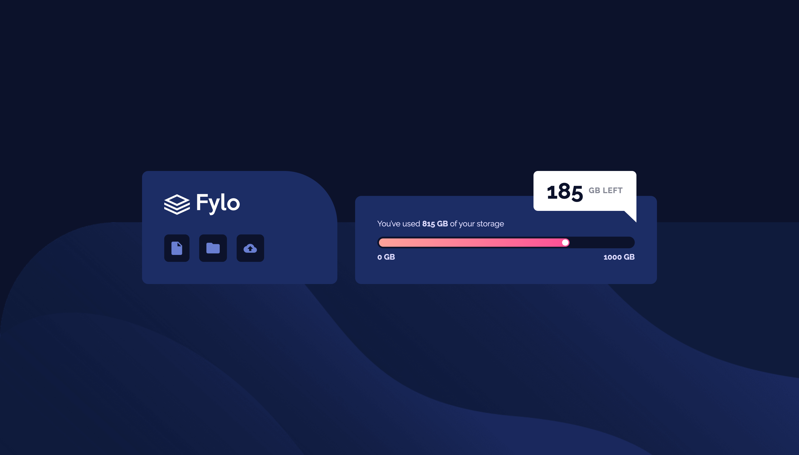

# Frontend Mentor - Fylo data storage component solution

This is a solution to the [Fylo data storage component challenge on Frontend Mentor](https://www.frontendmentor.io/challenges/fylo-data-storage-component-1dZPRbV5n).

## Table of contents

- [Overview](#overview)
  - [The challenge](#the-challenge)
  - [Screenshot](#screenshot)
  - [Links](#links)
- [My process](#my-process)
  - [Built with](#built-with)
  - [What I learned](#what-i-learned)
  - [Continued development](#continued-development)
  - [Useful resources](#useful-resources)
- [Author](#author)

## Overview

### The challenge

Users should be able to:

- View the optimal layout for the site depending on their device's screen size

### Screenshot



### Links

- Solution URL: [https://github.com/kongguksu/data-storage-component.git]
- Live Site URL: [https://kongguksu.github.io/data-storage-component/]

## My process

### Built with

- Semantic HTML5 markup
- CSS custom properties
- Flexbox
- Desktop-first workflow

### What I learned

- I learned how to make a speech bubble shape using pseudo element and its border properties.

```css
.speech-bubble {
  position: absolute;
  top: 0;
  right: 4%;
  display: flex;
  align-items: center;
  justify-content: center;

  background-color: #fff;
  border-top-left-radius: 0.5rem;
  border-top-right-radius: 0.5rem;
  border-bottom-left-radius: 0.5rem;

  box-shadow: 0 0.2rem 0.4rem rgba(0, 0, 0, 0.2);
  padding: 1rem 1.5rem;

  animation: moveUp 0.6s ease-in-out;
  animation-delay: 0.4s;
  animation-fill-mode: both;
  backface-visibility: hidden;
}

.speech-bubble::before {
  position: absolute;
  bottom: -49%;
  right: 0;
  transform: translateY(-50%);

  content: "";
  width: 0;
  height: 0;
  border-right: 0px solid transparent;
  border-top: 21px solid #fff;
  border-left: 22px solid transparent;

  padding-top: 3px;
}
```

- I also learned how to make a progress bar animation and animation-fill-mode property to make the element invisible before the animation.

```html
<div class="bar">
  <span class="bar-gauge">
    <span class="bar-circle"></span>
  </span>
</div>
```

```css
.bar {
  position: relative;

  width: 100%;
  height: 1.3rem;
  justify-self: center;

  border-radius: 10rem;
  background-color: hsl(229, 57%, 11%);

  padding: 3px;
}

.bar-gauge {
  position: relative;
  display: block;

  height: 100%;
  width: 75.2%;

  background-image: linear-gradient(
    to right,
    hsl(6, 100%, 80%),
    hsl(335, 100%, 65%)
  );
  border-radius: 10rem;

  animation: barGaugeMove 0.8s ease-out;
  backface-visibility: hidden;
}

.bar-circle {
  position: absolute;
  top: 1.5px;
  right: 3px;

  display: inline-block;

  width: 0.7rem;
  height: 0.7rem;
  border-radius: 50%;
  background-color: #fff;
}

@keyframes barGaugeMove {
  0% {
    opacity: 0;
    width: 0;
  }

  100% {
    opacity: 1;
    width: 75.2%;
  }
}
```

### Continued development

I still need to learn more about CSS animation. I'm planning on taking Advanced CSS lectures after I finish learning JavaScript basics.

### Useful resources

- [Progress Bar Animation](https://css-tricks.com/css3-progress-bars/) - This helped me understand how to make progress bar animation.
- [animation-fill-mode Property](https://stackoverflow.com/questions/15404520/css-keyframe-animation-hiding-element-before-animation-starts#:~:text=Easiest%20method%20would%20just%20be,the%20animation%20before%20and%20after.&text=This%20should%20be%20the%20accepted,also%20before%20the%20animation%20starts.) - This helped me make my element invisible before animation.

## Author

- Frontend Mentor - [@kongguksu](https://www.frontendmentor.io/profile/kongguksu)
- Twitter - [@sooj2050](https://www.twitter.com/sooj2050)
